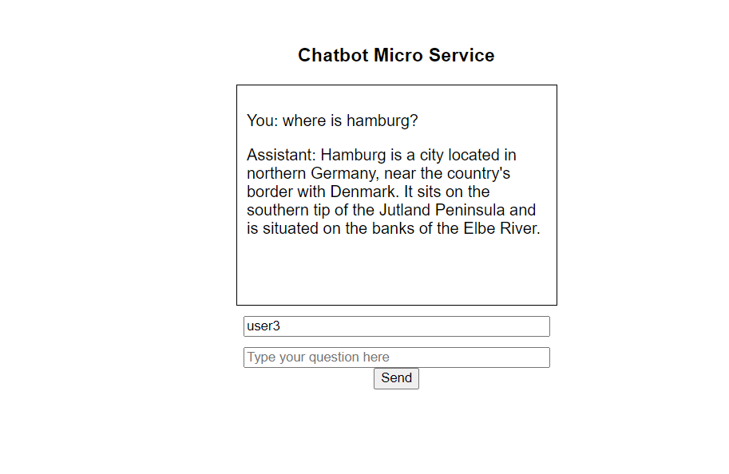

# Chatbot Microservice

This repository contains a microservice for a chatbot application. The microservice is built using FastAPI and integrates with the OpenAI API for natural language understanding. It allows users to interact with the chatbot by sending text messages and receiving responses.


## Features

- Accepts user input text and provides responses using OpenAI API.
- Stores conversation history in MongoDB.
- Provides an API for extracting the conversation history.
- Integrates with FastAPI for the web service.


## Prerequisites

- Python 3.7 or later
- [pip](https://pip.pypa.io/en/stable/installing/) package manager
- [MongoDB](https://docs.mongodb.com/manual/installation/) database
- [OpenAI API key](https://beta.openai.com/docs/developer-quickstart/your-api-keys)

## Directory Structure

The repository has the following structure:

```
chatbot-microservice/
  |- .venv/                   # Virtual environment directory
  |- outputs/                     # Sample outputs folder
  |   |- history.txt              # History text of the given user
  |   |- output.mp3                 # Sample response audio file
  |- start_bot.py          # Python script to start and use the bot
  |- microservice.py          # Python script for the chatbot micro service
  |- microservice.ipynb          # Python notebook to test and use the micro service chatbot
  |- cbtbox.html               # HTML file for the chat UI
  |- requirements.txt         # List of required Python packages
  |- README.md                # This README file
```
##

## Files Explanation

- `start_bot.py`: This is a Python script used to start and use the bot.
  
- `microservice.py`: This Python script creates the chatbot microservice using the FastAPI framework. It defines the endpoints for chatting with the bot, getting the history of a user, and fetching the latest audio response. The script also includes the logic for interacting with the MongoDB database and OpenAI's GPT-3.5 model.

- `microservice.ipynb`: This Jupyter notebook demonstrates how to test and use the microservice chatbot. It includes making HTTP requests to the microservice and handling the responses.

- `chatbox.html`: This HTML file is the frontend chat UI that interacts with the chatbot microservice. Users can send messages and receive responses from the bot in this interface.


## Setup

1. Clone the repository:

   ```bash
   git clone https://github.com/your-username/chatbot-microservice.git
   cd chatbot-microservice
   ```

2. Create and activate a virtual environment (requires Python 3.7+):

   ```bash
   python3 -m venv .venv
   source .venv/bin/activate
   ```

3. Install the required packages:

   ```bash
   pip install -r requirements.txt
   ```
## Usage 1

To run the microservice and interact with the bot using the Swagger UI, use the `uvicorn` ASGI server:

1. Ensure that your virtual environment is active, and you have installed all necessary dependencies by following the steps in the Setup section.

2. Run the command:

   ```bash
   uvicorn microservice:app --reload
   ```

   This command starts the `uvicorn` server with the FastAPI application defined in `microservice.py`. The `--reload` flag enables hot reloading, which means the server will automatically update whenever you make changes to the code.

3. Open your browser and navigate to the base URL [http://127.0.0.1:8000](http://127.0.0.1:8000). You should see a message confirming that the chatbot is running.

4. To interact with the chatbot and test the API endpoints, navigate to [http://127.0.0.1:8000/docs](http://127.0.0.1:8000/docs). This URL opens the interactive FastAPI documentation generated by Swagger UI. Here you can:

   - Send POST requests to the `/chat` endpoint to chat with the bot. You will need to provide a `user_id` and a `message` in the request body.
   - Send GET requests to the `/history/{user_id}` endpoint to retrieve the conversation history for a specific user. Replace `{user_id}` in the URL with the actual user ID.
   - Send GET requests to the `/audio` endpoint to retrieve the latest response from the bot as an audio file.


## Usage 2

Use `microservice.ipynb` to test and interact with the microservice chatbot. 

## UI



